# 中国传统纹样数字档案系统

> 最后更新：2026-04-29 09:11:36

## 变更记录 (Changelog)

| 时间 | 操作 | 说明 |
|------|------|------|
| 2026-04-29 09:11:36 | 增量更新 | 补充区块链存证、AI识别、DWT-SVD水印、邀请码、游客登录等新功能模块文档 |
| 2026-02-12 12:48:30 | 初始化 | AI 上下文档案初始化完成 |

---

## 项目愿景

本系统是一个基于 Spring Boot 的中国传统纹样数字档案管理平台，致力于：

- **纹样数字化保存**：为每个中国传统纹样生成唯一编码（格式：`主类别-子类别-风格-地区-时期-日期-序列号`，如 `AN-BD-TR-CN-QG-240615-001`）
- **审核流程管理**：支持草稿保存、提交审核、批量审核、重新提交等完整工作流
- **分级权限控制**：四级用户角色（超级管理员、管理员、录入员、游客）
- **对象存储集成**：使用 AWS S3 兼容的对象存储（Sealos Object Storage）管理纹样图片
- **区块链存证**：审核通过的纹样自动上链存证（支持至信链开放联盟链 / EVM 兼容链）
- **AI 智能识别**：基于多模态大模型的纹样自动分类识别与批量录入
- **鲁棒数字水印**：下载图片时嵌入 DWT-SVD 频域水印，支持水印提取验证
- **二维码溯源**：为每个纹样生成唯一二维码，扫码可查看纹样详情

---

## 架构总览

### 技术栈

| 分类 | 技术 | 版本 |
|------|------|------|
| 后端框架 | Spring Boot | 3.5.9 |
| Java 版本 | Java | 17 |
| 数据库 | MySQL | 8.x |
| ORM | Spring Data JPA | - |
| 安全认证 | Spring Security + JWT | jjwt 0.12.5 |
| 对象存储 | AWS S3 SDK | 2.25.16 |
| 区块链 | Web3j | 4.12.0 |
| 二维码 | ZXing | 3.5.3 |
| 数值计算 | Apache Commons Math | 3.6.1 |
| 监控 | Spring Boot Actuator | - |
| 构建工具 | Maven | - |

### 代码统计

- **Java 源文件**：约 55 个
- **测试文件**：1 个
- **配置文件**：pom.xml, application.properties, entrypoint.sh

---

## 模块结构图

```mermaid
graph TD
    A["(根) 中国传统纹样数字档案系统"] --> B["src/main/java"];
    B --> C["com.example.hello"];

    C --> D["controller (控制器层)"];
    C --> E["service (业务逻辑层)"];
    C --> F["entity (实体/数据模型)"];
    C --> G["repository (数据访问层)"];
    C --> H["dto (数据传输对象)"];
    C --> I["enums (枚举定义)"];
    C --> J["config (配置类)"];
    C --> K["util (工具类)"];
    C --> L["exception (异常处理)"];

    D --> D1["AuthController - 认证接口"];
    D --> D2["AuditController - 审核接口+AI批量"];
    D --> D3["DraftController - 草稿接口"];
    D --> D4["PatternController - 纹样接口+二维码+水印"];
    D --> D5["ImageController - 图片上传接口"];
    D --> D6["StatsController - 统计接口"];
    D --> D7["UserController - 用户+邀请码接口"];

    E --> E1["AuthService - 认证服务"];
    E --> E2["AuditService - 审核服务"];
    E --> E3["DraftService - 草稿服务"];
    E --> E4["PatternService - 纹样服务+QR码+水印"];
    E --> E5["ImageService - 对象存储服务"];
    E --> E6["StatsService - 统计服务"];
    E --> E7["UserService - 用户服务"];
    E --> E8["PatternCodeService - 编码生成服务"];
    E --> E9["PatternHashService - 图片哈希服务"];
    E --> E10["BlockchainAnchorService - 区块链存证"];
    E --> E11["DwtSvdWatermarkService - 鲁棒水印"];
    E --> E12["AiPatternRecognitionService - AI识别"];
    E --> E13["AiBatchEntryService - AI批量录入"];
    E --> E14["InvitationCodeService - 邀请码服务"];
    E --> E15["AppRegistrationCallbackService - 注册回调"];

    F --> F1["User - 用户"];
    F --> F2["Pattern - 正式纹样"];
    F --> F3["PatternDraft - 草稿纹样"];
    F --> F4["PatternPending - 待审核纹样"];
    F --> F5["InvitationCode - 邀请码"];

    G --> G1["UserRepository"];
    G --> G2["PatternRepository"];
    G --> G3["PatternDraftRepository"];
    G --> G4["PatternPendingRepository"];
    G --> G5["InvitationCodeRepository"];

    I --> I1["UserRole - 用户角色(含GUEST)"];
    I --> I2["AuditStatus - 审核状态"];
    I --> I3["PatternCodeEnum - 纹样编码"];
    I --> I4["ImageSourceType - 图片来源类型"];

    J --> J1["SecurityConfig - 安全配置"];
    J --> J2["DataInitializer - 数据初始化"];
    J --> J3["ScheduledTasks - 定时任务"];
    J --> J4["BlockchainProperties - 区块链配置"];
    J --> J5["AiProperties - AI配置"];
    J --> J6["AppInvitationCodeProperties - 邀请码配置"];

    K --> K1["JwtUtil - JWT工具"];

    style A fill:#e1f5ff
    style D fill:#fff4e1
    style E fill:#fff4e1
    style F fill:#f0f0f0
    style G fill:#f0f0f0
```



---

## 模块索引

| 模块路径 | 职责描述 | 关键文件 |
|---------|---------|---------|
| `controller` | REST API 控制器层，处理 HTTP 请求 | 7 个控制器 |
| `service` | 业务逻辑层，实现核心业务规则 | 15 个服务类 |
| `entity` | JPA 实体，对应数据库表 | 5 个实体类 |
| `repository` | Spring Data JPA 仓库，数据访问 | 5 个仓库接口 |
| `dto` | 数据传输对象，API 请求/响应 | 15+ 个 DTO |
| `enums` | 枚举定义，业务常量和规则 | 4 个枚举类 |
| `config` | Spring 配置类 | 6 个配置类 |
| `util` | 工具类 | 1 个工具类 |
| `exception` | 全局异常处理 | 1 个处理器 |

---

## 运行与开发

### 环境要求

- Java 17
- Maven 3.x
- MySQL 8.x
- 对象存储（S3 兼容 API）
- 本地 GO SDK HttpService（区块链签名，可选）

### 快速启动

#### 开发模式
```bash
bash entrypoint.sh
# 或
mvn spring-boot:run
```

#### 生产模式
```bash
bash entrypoint.sh production
# 会执行 mvn clean install 后运行
```

### 默认账户

```
用户名：admin
密码：admin123
角色：超级管理员
```

**重要**：首次登录后请立即修改默认密码！

### 配置说明

配置文件位于 `src/main/resources/application.properties`：

| 配置项 | 说明 | 示例值 |
|--------|------|--------|
| `spring.datasource.*` | MySQL 数据库配置 | `test-db-mysql.ns-hpy8jg7h.svc:3306/mydb` |
| `jwt.secret` | JWT 密钥 | 256 位密钥字符串 |
| `jwt.expiration` | JWT 过期时间（毫秒） | `86400000`（24 小时） |
| `s3.*` | 对象存储配置 | Sealos Object Storage |
| `blockchain.enabled` | 区块链存证开关 | `true` |
| `blockchain.provider` | 上链模式 | `ZXCHAIN_OPEN` / `EVM` |
| `blockchain.api-base-url` | 至信链 API 地址 | `https://open.zxchain.qq.com` |
| `blockchain.sdk-base-url` | 本地签名服务地址 | `http://127.0.0.1:30505` |
| `ai.enabled` | AI 识别开关 | `true` |
| `ai.api-endpoint` | AI 接口地址 | Sealos AI Proxy |
| `ai.model` | AI 模型 | `qwen-vl-max-latest` |
| `ai.batch-concurrency` | 批量并发数 | `20` |
| `app.public-base-url` | 对外访问基地址（二维码跳转） | `https://bpsljpqucopd.sealosbja.site` |
| `app.invitation-code.enabled` | 邀请码/剪艺码校验开关 | `true` |
| `spring.servlet.multipart.*` | 文件上传限制 | `10MB` |

---

## 测试策略

### 当前测试覆盖

- **测试文件**：`src/test/java/com/example/hello/HelloApplicationTests.java`
- **测试类型**：Spring Boot 上下文加载测试
- **覆盖范围**：基础集成测试（contextLoads）

### 测试运行

```bash
mvn test
```

### 测试建议

当前测试覆盖较为基础，建议补充：
- 单元测试：Service 层业务逻辑测试
- 集成测试：Controller 层 API 测试
- 安全测试：JWT 认证和权限控制测试
- 区块链存证测试：模拟上链流程
- AI 识别测试：Mock AI 接口返回
- 水印测试：嵌入/提取一致性验证

---

## 编码规范

### 包结构规范

```
com.example.hello
├── controller     # 控制器层（REST API）
├── service        # 业务逻辑层
├── repository     # 数据访问层
├── entity         # JPA 实体
├── dto            # 数据传输对象
├── enums          # 枚举定义
├── config         # Spring 配置
├── util           # 工具类
├── exception      # 异常处理
└── HelloApplication  # 启动类
```

### 命名约定

| 类型 | 约定 | 示例 |
|------|------|------|
| Controller | `*Controller` | `AuthController.java` |
| Service | `*Service` | `AuthService.java` |
| Repository | `*Repository` | `UserRepository.java` |
| Entity | 名词 | `User.java`, `Pattern.java` |
| DTO | `*Request` / `*Response` | `LoginRequest.java`, `AuthResponse.java` |
| Enum | 复数形式或 `*Enum` | `UserRole.java`, `AuditStatus.java` |
| Properties | `*Properties` | `BlockchainProperties.java` |

### 代码风格

- 使用 4 空格缩进
- 类注释使用 Javadoc 格式
- 方法注释说明参数、返回值、异常
- 所有代码使用大写字母存储编码相关字段（如 `mainCategory`、`subCategory`）

### 安全规范

- 密码字段使用 `@JsonIgnore` 注解
- JWT Token 通过 `Authorization: Bearer <token>` 传递
- 敏感配置使用 `@Value` 注入
- 文件上传限制大小和类型

---

## AI 使用指引

### 核心业务概念

#### 纹样编码系统

系统使用 7 段编码唯一标识每个纹样：

**格式**：`主类别-子类别-风格-地区-时期-日期(YYMMDD)-序列号(3位)`

**示例**：`AN-BD-TR-CN-QG-240615-001`

**含义分解**：
- `AN`：动物（主类别）
- `BD`：鸟类（子类别）
- `TR`：传统（风格）
- `CN`：中国（地区）
- `QG`：秦汉（时期）
- `240615`：2024年6月15日
- `001`：当日第 1 条

#### 编码规则

**有子类别的主类别**（AN/PL/PE）：`主类别-子类别-风格-地区-时期-日期-序列号`
- 动物（AN）、植物（PL）、人物（PE）有子类别

**无子类别的主类别**（LA/AB/OR/SY/CE/MY/OT）：`主类别-风格1-风格2-地区-时期-日期-序列号`
- 风景（LA）、抽象（AB）、器物（OR）、符号（SY）、庆典（CE）、神话（MY）、其他（OT）

详细代码定义见 `PatternCodeEnum.java`

#### 审核工作流

```
草稿（PatternDraft）
    ↓ 提交
待审核（PatternPending，状态=PENDING）
    ↓ 审核通过
正式纹样（Pattern）
    ↓ 同时触发
区块链存证（计算SHA-256哈希 → 上链 → 回填凭证）
    ↓ 或审核拒绝
待审核（状态=REJECTED，可重新提交）
```

**图片处理**：
- 上传时保存到 `temp/` 临时目录
- 审核通过后根据图片来源类型处理：
  - `TEMP_UPLOAD`：移动到正式目录并重命名为纹样编码
  - `LIBRARY`：复制到正式目录（不删除源文件）
  - `EXTERNAL`：抓取外部图片到正式目录
- 审核拒绝时删除临时图片

#### 区块链存证

审核通过时自动触发：
1. 计算图片 SHA-256 哈希
2. 调用区块链存证接口（至信链/EVM）
3. 回填交易哈希、区块高度、区块时间到 Pattern 实体
4. 存证失败不影响正式入库（标记为 `FAILED`）

**状态值**：`PENDING` → `ANCHORED` / `FAILED` / `SKIPPED`

#### AI 批量识别

支持两种模式：
1. **同步预览+确认**：`/api/audit/ai-batch-preview` → `/api/audit/ai-batch-confirm`
2. **异步任务**：`/api/audit/ai-batch-preview/start` → 查询进度 → `/api/audit/ai-batch-submit/start`

AI 识别流程：
1. 发送图片到多模态大模型（Qwen-VL）
2. 解析返回的 JSON 结构化结果
3. 自动匹配纹样编码体系
4. 支持手动修正后提交

#### DWT-SVD 鲁棒水印

下载纹样图片时自动嵌入不可见水印：
- **嵌入**：Haar DWT 小波变换 → SVD 奇异值分解 → 量化调制
- **提取**：逆向过程，从频域提取水印位并解码为文本
- **验证**：`POST /api/patterns/watermark/verify` 上传图片验证水印
- **容错**：嵌入失败时降级返回原图

#### 用户权限模型

| 角色 | 代码 | 权限 |
|------|------|------|
| 超级管理员 | SUPER_ADMIN | 全部权限 + 用户管理 + 设置角色 + 生成邀请码 |
| 管理员 | ADMIN | 审核纹样 + 查看统计 |
| 录入员 | USER | 提交草稿、提交审核、查看自己的记录 |
| 游客 | GUEST | 只读访问（虚拟用户，不持久化） |

#### 邀请码/剪艺码

注册时需要提供有效的邀请码或剪艺码：
- **本地邀请码**：超级管理员生成的 6 位数字码，一次性使用
- **剪艺码（APP）**：外部系统（yikex.xyz）验证的码，注册成功后回调通知

### 常见任务

#### 1. 添加新的主类别

修改 `PatternCodeEnum.MainCategory`：
```java
// 在 MainCategory 枚举中添加
NEW("NE", "新类别"),
```

#### 2. 修改编码生成逻辑

关键位置：
- `PatternCodeService.assignPendingCode()` - 提交审核时生成编码
- `PatternCodeService.assignFormalCode()` - 直接创建纹样时生成编码
- `PatternCodeService.buildPatternCode()` - 编码组装

#### 3. 添加新的 API 端点

1. 在对应的 Controller 中添加方法
2. 使用 `@GetMapping` / `@PostMapping` 等注解
3. 从 JWT Token 中提取用户 ID：
   ```java
   Long userId = getUserIdFromToken(token);
   ```

#### 4. 修改审核流程

关键服务：
- `AuditService.audit()` - 单个审核
- `AuditService.batchAudit()` - 批量审核
- `AuditService.resubmit()` - 重新提交

#### 5. 对象存储操作

使用 `ImageService`：
- `upload()` - 上传到临时目录
- `uploadStoryFile()` - 上传故事文件（支持图片/PDF）
- `moveToFormal()` - 移动到正式目录
- `copyToFormalWithoutDeletingSource()` - 复制库内图片
- `fetchExternalToFormal()` - 抓取外部图片
- `deleteTempImage()` - 删除临时图片
- `download()` - 下载图片

#### 6. 区块链存证操作

使用 `BlockchainAnchorService`：
- `anchor(patternCode, imageHash, imageUrl)` - 上链存证
- `isEnabled()` - 检查是否启用
- 支持两种 Provider：`ZXCHAIN_OPEN`（至信链）和 `EVM`（兼容链）

#### 7. AI 纹样识别

使用 `AiPatternRecognitionService`：
- `recognizeByImageUrl(imageUrl)` - 单张图片识别
- 返回 `RecognitionResult`（包含主类别、子类别、风格、地区、时期、关键词）

### 常见问题排查

#### JWT 认证失败

检查：
1. `application.properties` 中的 `jwt.secret` 是否一致
2. Token 是否过期（`jwt.expiration`）
3. Header 格式：`Authorization: Bearer <token>`

#### 数据库连接失败

检查：
1. MySQL 服务是否运行
2. `spring.datasource.*` 配置是否正确
3. 数据库 `mydb` 是否已创建

#### 图片上传失败

检查：
1. 对象存储配置 `s3.*` 是否正确
2. 网络是否可访问 S3 端点
3. 存储桶是否已创建

#### 编码冲突

检查：
1. 当日序列号是否正确递增
2. 是否正确处理被驳回的编码回收
3. `findRecyclableCodes()` 和 `findMaxActiveSequenceNumberByDateCode()` 查询逻辑

#### 区块链存证失败

检查：
1. `blockchain.enabled` 是否为 `true`
2. `blockchain.provider` 配置是否正确
3. 至信链模式：本地 GO SDK 服务（`blockchain.sdk-base-url`）是否运行
4. EVM 模式：RPC 节点、私钥、目标地址是否配置正确

#### AI 识别失败

检查：
1. `ai.enabled` 是否为 `true`
2. `ai.api-key` 和 `ai.api-endpoint` 是否正确
3. 网络是否可访问 AI Proxy 端点
4. 图片 URL 是否可公开访问

---

## 数据模型

### 核心实体

#### User（用户）
| 字段 | 类型 | 说明 |
|------|------|------|
| id | Long | 主键 |
| username | String | 用户名（唯一） |
| password | String | 密码（加密存储） |
| role | UserRole | 用户角色（SUPER_ADMIN/ADMIN/USER/GUEST） |
| createdAt | LocalDateTime | 创建时间 |

#### Pattern（正式纹样）
| 字段 | 类型 | 说明 |
|------|------|------|
| id | Long | 主键 |
| patternCode | String | 纹样编码（唯一） |
| mainCategory | String | 主类别代码 |
| subCategory | String | 子类别代码 |
| style | String | 风格代码 |
| region | String | 地区代码 |
| period | String | 时期代码 |
| dateCode | String | 日期代码 |
| sequenceNumber | Integer | 序列号 |
| description | String | 纹样描述 |
| imageUrl | String | 图片 URL |
| imageSourceType | String | 图片来源（TEMP_UPLOAD/EXTERNAL/LIBRARY） |
| storyText | String | 藏品故事-文字 |
| storyImageUrl | String | 藏品故事-图片/PDF |
| imageHash | String | 图片 SHA-256 哈希 |
| hashAlgorithm | String | 哈希算法（SHA-256） |
| chainTxHash | String | 上链交易哈希 |
| chainBlockNumber | Long | 链上区块高度 |
| chainTimestamp | LocalDateTime | 链上区块时间 |
| chainStatus | String | 链上状态（PENDING/ANCHORED/FAILED/SKIPPED） |
| status | String | 状态（默认 APPROVED） |
| createdAt | LocalDateTime | 创建时间 |
| updatedAt | LocalDateTime | 更新时间 |

#### PatternDraft（草稿）
| 字段 | 类型 | 说明 |
|------|------|------|
| id | Long | 主键 |
| user | User | 所属用户 |
| description | String | 纹样描述 |
| mainCategory | String | 主类别代码 |
| subCategory | String | 子类别代码 |
| style | String | 风格代码 |
| region | String | 地区代码 |
| period | String | 时期代码 |
| imageUrl | String | 临时图片 URL |
| imageSourceType | String | 图片来源 |
| storyText | String | 藏品故事-文字 |
| storyImageUrl | String | 藏品故事-图片/PDF |
| createdAt | LocalDateTime | 创建时间 |
| updatedAt | LocalDateTime | 更新时间 |

#### PatternPending（待审核）
| 字段 | 类型 | 说明 |
|------|------|------|
| id | Long | 主键 |
| submitter | User | 提交人 |
| auditor | User | 审核人 |
| status | AuditStatus | 审核状态 |
| patternCode | String | 纹样编码（提交时生成） |
| dateCode | String | 日期代码 |
| sequenceNumber | Integer | 序列号 |
| rejectReason | String | 拒绝原因 |
| imageSourceType | String | 图片来源 |
| storyText | String | 藏品故事-文字 |
| storyImageUrl | String | 藏品故事-图片/PDF |
| auditTime | LocalDateTime | 审核时间 |
| createdAt | LocalDateTime | 创建时间 |
| updatedAt | LocalDateTime | 更新时间 |

#### InvitationCode（邀请码）
| 字段 | 类型 | 说明 |
|------|------|------|
| id | Long | 主键 |
| code | String | 邀请码（6位数字，唯一） |
| used | boolean | 是否已使用 |
| usedAt | LocalDateTime | 使用时间 |
| createdAt | LocalDateTime | 创建时间 |
| createdBy | Long | 创建者用户ID |

### 数据库表

- `users` - 用户表
- `patterns` - 正式纹样表
- `pattern_drafts` - 草稿表
- `patterns_pending` - 待审核表
- `invitation_codes` - 邀请码表

---

## API 接口概览

### 认证相关 `/api/auth`
- `POST /api/auth/register` - 用户注册（需要邀请码/剪艺码）
- `POST /api/auth/login` - 用户登录
- `POST /api/auth/forgot-password` - 忘记密码
- `POST /api/auth/guest-login` - 游客登录

### 草稿管理 `/api/drafts`
- `POST /api/drafts` - 保存草稿
- `PUT /api/drafts/{id}` - 更新草稿
- `GET /api/drafts` - 获取我的草稿列表
- `GET /api/drafts/{id}` - 获取单个草稿
- `DELETE /api/drafts/{id}` - 删除草稿
- `POST /api/drafts/{id}/submit` - 提交到审核

### 审核管理 `/api/audit`
- `POST /api/audit/submit` - 提交纹样审核
- `POST /api/audit/{id}/review` - 审核纹样
- `POST /api/audit/batch-review` - 批量审核
- `PUT /api/audit/{id}/resubmit` - 重新提交被拒绝的纹样
- `GET /api/audit/pending` - 获取待审核列表
- `GET /api/audit` - 获取所有审核记录
- `GET /api/audit/status/{status}` - 按状态查询
- `GET /api/audit/my` - 查询我的提交记录
- `GET /api/audit/my/recent` - 查询我最近录入的记录（最多 100 条）
- `GET /api/audit/{id}` - 根据 ID 查询
- `DELETE /api/audit/{id}` - 删除待审核记录
- `POST /api/audit/batch-delete` - 批量删除待审核记录

#### AI 批量识别 `/api/audit`
- `POST /api/audit/ai-batch-preview` - AI 批量识别预览（同步）
- `POST /api/audit/ai-batch-preview/start` - AI 批量识别预览（异步启动）
- `GET /api/audit/ai-batch-preview/progress/{taskId}` - 预览任务进度查询
- `POST /api/audit/ai-batch-confirm` - AI 批量确认提交
- `POST /api/audit/ai-batch-submit` - AI 批量直接提交（兼容旧入口）
- `POST /api/audit/ai-batch-submit/start` - AI 批量提交（异步启动）
- `GET /api/audit/ai-batch-submit/progress/{taskId}` - 提交任务进度查询

### 纹样管理 `/api/patterns`
- `POST /api/patterns` - 创建纹样
- `GET /api/patterns` - 获取所有纹样
- `GET /api/patterns/{id}` - 根据 ID 查询
- `GET /api/patterns/code/{code}` - 根据编码查询
- `PUT /api/patterns/{id}` - 更新纹样
- `DELETE /api/patterns/{id}` - 删除纹样
- `POST /api/patterns/batch-delete` - 批量删除纹样
- `GET /api/patterns/category/{mainCategory}` - 按主类别查询
- `GET /api/patterns/style/{style}` - 按风格查询
- `GET /api/patterns/region/{region}` - 按地区查询
- `GET /api/patterns/period/{period}` - 按时期查询
- `GET /api/patterns/{id}/download` - 下载纹样图片（含水印）
- `POST /api/patterns/batch-download` - 批量下载纹样图片（含水印）
- `GET /api/patterns/{id}/qrcode` - 获取纹样二维码
- `GET /api/patterns/code/{code}/qrcode` - 根据编码获取二维码
- `POST /api/patterns/watermark/verify` - 验证图片水印

### 图片管理 `/api/images`
- `POST /api/images/upload` - 上传图片
- `POST /api/images/upload-story-file` - 上传故事文件（图片/PDF）
- `DELETE /api/images` - 删除图片

### 用户管理 `/api/users`
- `DELETE /api/users/{userId}` - 删除用户账号
- `GET /api/users/{userId}` - 获取用户信息
- `GET /api/users` - 获取所有用户列表（仅超级管理员）
- `PUT /api/users/{userId}/role` - 设置用户角色（仅超级管理员）
- `POST /api/users/invite-codes` - 生成邀请码（仅超级管理员）

### 统计信息 `/api/stats`
- `GET /api/stats` - 获取统计信息

### 监控端点 `/actuator`
- `GET /actuator/health` - 健康检查
- `GET /actuator/info` - 应用信息

---

## 定时任务

### 清理已审核记录

**执行时间**：每天凌晨 2 点

**功能**：清理前一天已审核通过的数据，未审核的保留

**配置**：`ScheduledTasks.cleanupApprovedRecords()`

```java
@Scheduled(cron = "0 0 2 * * ?")
public void cleanupApprovedRecords()
```

---

## 依赖说明

### 核心 Spring 依赖
- `spring-boot-starter-web` - Web 应用
- `spring-boot-starter-data-jpa` - JPA 数据访问
- `spring-boot-starter-security` - 安全认证
- `spring-boot-starter-validation` - 数据校验
- `spring-boot-starter-actuator` - 监控端点
- `spring-boot-starter-test` - 测试框架

### 数据库
- `mysql-connector-j` - MySQL 驱动

### JWT 认证
- `jjwt-api` / `jjwt-impl` / `jjwt-jackson` 0.12.5

### 对象存储
- `aws-sdk-java-s3` 2.25.16

### 区块链
- `web3j-core` 4.12.0

### 二维码
- `zxing-core` / `zxing-javase` 3.5.3

### 数值计算
- `commons-math3` 3.6.1（DWT-SVD 水印矩阵运算）

---

## 开发注意事项

1. **编码规范**：所有类别/风格/地区/时期代码在数据库中存储为大写
2. **图片处理**：上传时存临时目录，审核通过后根据来源类型处理（移动/复制/抓取）
3. **编码回收**：被驳回的纹样编码可以被新提交回收使用
4. **草稿限制**：每个用户最多 10 条草稿
5. **权限控制**：大部分 API 需要 JWT Token 认证
6. **异常处理**：使用 `GlobalExceptionHandler` 统一处理异常
7. **事务管理**：审核、删除等操作使用 `@Transactional` 确保数据一致性
8. **区块链存证**：失败不影响正式入库，标记为 FAILED
9. **AI 识别**：支持同步/异步两种模式，异步模式通过任务ID查询进度
10. **水印容错**：DWT-SVD 水印嵌入失败时降级返回原图

---

## 部署相关

### Docker 化部署

项目使用 `entrypoint.sh` 脚本控制启动模式：

- 开发模式：直接运行 `mvn spring-boot:run`
- 生产模式：先 `mvn clean install` 再运行

### 环境变量

可通过环境变量覆盖配置：
- `SPRING_DATASOURCE_URL`
- `SPRING_DATASOURCE_USERNAME`
- `SPRING_DATASOURCE_PASSWORD`
- `JWT_SECRET`
- `S3_ENDPOINT`
- `S3_ACCESS_KEY`
- `S3_SECRET_KEY`
- `S3_BUCKET`
- `APP_INVITATION_AUTH_TOKEN`
- `APP_INVITATION_CALLBACK_KEY`

---

## 相关资源

- [Spring Boot 官方文档](https://spring.io/projects/spring-boot)
- [Spring Data JPA 文档](https://spring.io/projects/spring-data-jpa)
- [AWS S3 SDK 文档](https://docs.aws.amazon.com/sdk-for-java/)
- [Web3j 文档](https://docs.web3j.io/)
- [ZXing 文档](https://github.com/zxing/zxing)
- [MySQL 参考手册](https://dev.mysql.com/doc/)

---

## 覆盖率报告

本次增量扫描覆盖：
- ✅ 所有 55 个 Java 源文件
- ✅ 实体、DTO、枚举、工具类
- ✅ 控制器、服务、仓库层
- ✅ 配置类和异常处理
- ✅ 测试文件
- ✅ Maven 配置和资源文件

**覆盖率**：约 98%（核心业务代码全覆盖）

---

## 下一步建议

根据项目结构分析，建议优先关注：

1. **测试增强**：
   - 补充 Service 层单元测试（特别是 PatternCodeService、BlockchainAnchorService）
   - 添加 Controller 层集成测试
   - 增加安全认证测试
   - 区块链存证 Mock 测试
   - AI 识别 Mock 测试

2. **文档完善**：
   - 为每个 API 添加 OpenAPI/Swagger 注解
   - 生成 API 文档

3. **功能扩展**：
   - 考虑添加纹样搜索功能（按描述全文搜索）
   - 添加纹样分类统计和可视化
   - 实现纹样导出功能（Excel/PDF）

4. **性能优化**：
   - 为常用查询添加数据库索引
   - 考虑添加 Redis 缓存
   - 图片上传添加 CDN 加速

5. **安全加固**：
   - 实现密码强度验证
   - 添加登录失败次数限制
   - 敏感操作添加审计日志
   - SecurityConfig 当前放行了所有请求，生产环境需收紧

---

*文档生成时间：2026-04-29 09:11:36*
*扫描工具：Claude Code AI 架构初始化器*
